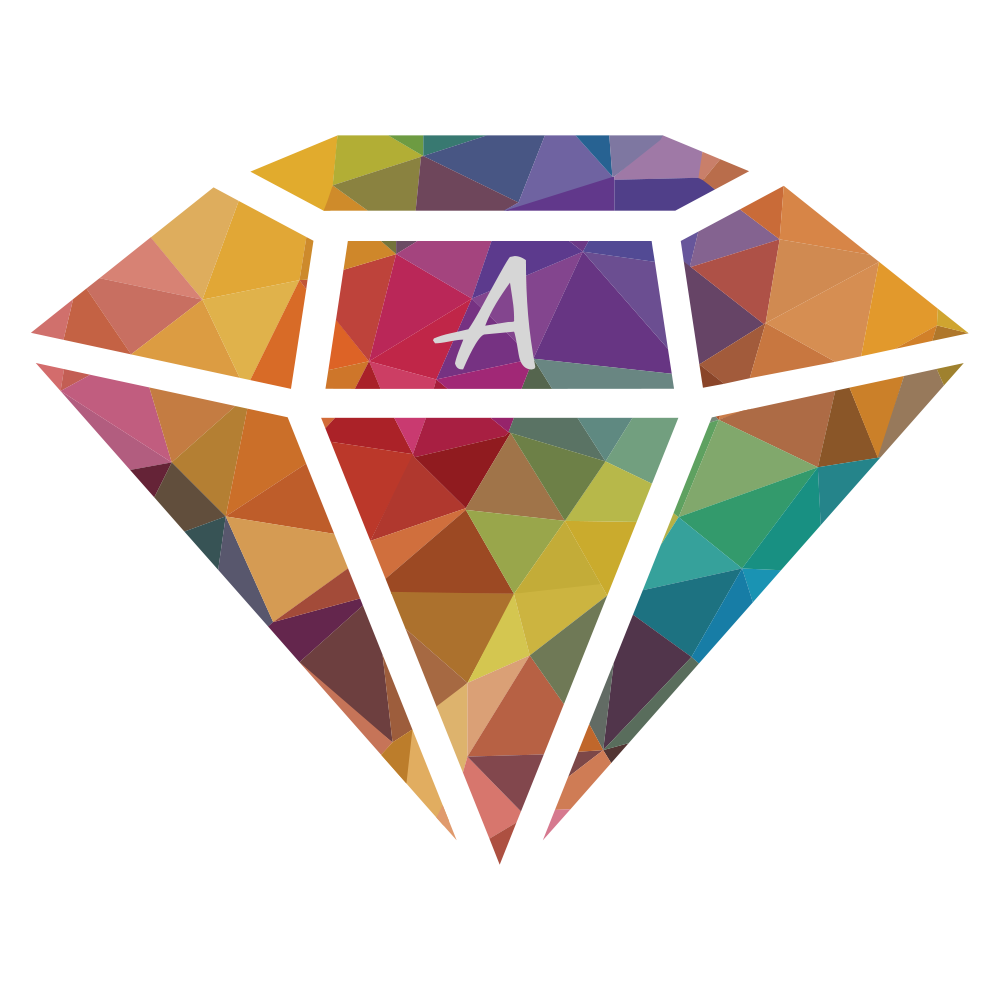

  

<h1 align="center">Hi 👋, I'm Xelzs (Axel S.)</h1>

<h3 align="center">
  DevOps, Web Developer, tech enthusiast and Open Source lover 
  Creator of <a href="https://github.com/axentix">@axentix</a>
</h3>

 

  
  

## 📘 My top open source projects

  
  
  
  

## 🔗 Connect with me

## 🔥 Streak stats

  

## 📊 Github stats

 
  
💻 GitHub Profile Stats

  
  

  
&nbsp;

